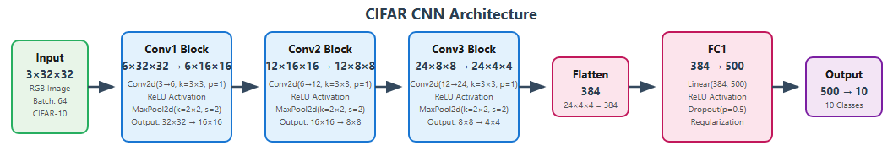
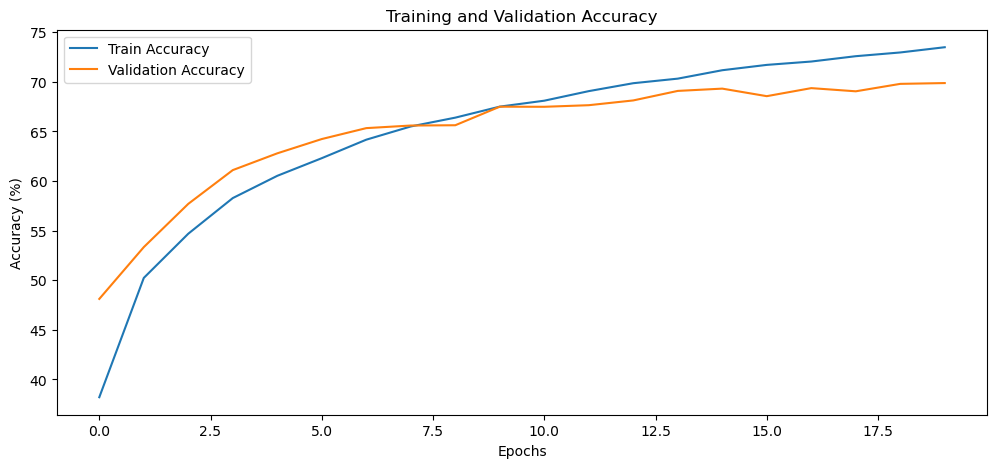

# CNN Architecture




A Convolutional Neural Network designed for CIFAR-10 image classification, implemented in PyTorch.

## Architecture Overview

This CNN follows a classic architecture pattern with three convolutional blocks followed by fully connected layers. The network progressively reduces spatial dimensions while increasing feature depth, making it suitable for the 32×32 RGB images in the CIFAR-10 dataset.

## Network Architecture

### Input Layer
- **Input Shape**: `3 × 32 × 32`
- **Data Type**: RGB images
- **Batch Size**: 64
- **Dataset**: CIFAR-10 (10 classes)

### Convolutional Layers

#### Conv1 Block
```python
nn.Conv2d(in_channels=3, out_channels=6, kernel_size=3, stride=1, padding=1)
nn.ReLU()
nn.MaxPool2d(kernel_size=2, stride=2)
```
- **Input**: `3 × 32 × 32`
- **After Conv**: `6 × 32 × 32`
- **After MaxPool**: `6 × 16 × 16`
- **Parameters**: `(3 × 3 × 3 + 1) × 6 = 162`

#### Conv2 Block
```python
nn.Conv2d(in_channels=6, out_channels=12, kernel_size=3, stride=1, padding=1)
nn.ReLU()
nn.MaxPool2d(kernel_size=2, stride=2)
```
- **Input**: `6 × 16 × 16`
- **After Conv**: `12 × 16 × 16`
- **After MaxPool**: `12 × 8 × 8`
- **Parameters**: `(3 × 3 × 6 + 1) × 12 = 660`

#### Conv3 Block
```python
nn.Conv2d(in_channels=12, out_channels=24, kernel_size=3, stride=1, padding=1)
nn.ReLU()
nn.MaxPool2d(kernel_size=2, stride=2)
```
- **Input**: `12 × 8 × 8`
- **After Conv**: `24 × 8 × 8`
- **After MaxPool**: `24 × 4 × 4`
- **Parameters**: `(3 × 3 × 12 + 1) × 24 = 2,616`

### Fully Connected Layers

#### Flatten Layer
- **Input**: `24 × 4 × 4`
- **Output**: `384` (flattened vector)
- **Operation**: Reshapes 3D feature maps to 1D vector

#### FC1 Layer
```python
nn.Linear(in_features=384, out_features=500)
nn.ReLU()
nn.Dropout(p=0.5)
```
- **Input**: `384`
- **Output**: `500`
- **Parameters**: `384 × 500 + 500 = 192,500`
- **Regularization**: 50% Dropout

#### Output Layer
```python
nn.Linear(in_features=500, out_features=10)
```
- **Input**: `500`
- **Output**: `10` (CIFAR-10 classes)
- **Parameters**: `500 × 10 + 10 = 5,010`

## Information Flow

The network processes images through the following stages:

1. **Input Processing**: 32×32×3 RGB images are fed into the network
2. **Feature Extraction**: Three convolutional blocks extract hierarchical features
3. **Spatial Reduction**: MaxPooling reduces spatial dimensions by half at each stage
4. **Feature Depth Increase**: Number of channels grows from 3 → 6 → 12 → 24
5. **Vectorization**: 3D feature maps are flattened to 1D vector (384 elements)
6. **Classification**: Fully connected layers map features to class probabilities

### Dimension Progression

| Stage | Operation | Input Shape | Output Shape | Spatial Size | Channels |
|-------|-----------|-------------|--------------|--------------|----------|
| Input | - | - | `3×32×32` | 1024 | 3 |
| Conv1+Pool | Conv+ReLU+MaxPool | `3×32×32` | `6×16×16` | 256 | 6 |
| Conv2+Pool | Conv+ReLU+MaxPool | `6×16×16` | `12×8×8` | 64 | 12 |
| Conv3+Pool | Conv+ReLU+MaxPool | `12×8×8` | `24×4×4` | 16 | 24 |
| Flatten | Reshape | `24×4×4` | `384×1` | 384 | 1 |
| FC1 | Linear+ReLU+Dropout | `384×1` | `500×1` | 500 | 1 |
| Output | Linear | `500×1` | `10×1` | 10 | 1 |

## Parameter Count

### Layer-wise Parameter Breakdown

| Layer | Type | Parameters | Calculation |
|-------|------|------------|-------------|
| Conv1 | Convolutional | 162 | `(3×3×3 + 1) × 6 = 162` |
| Conv2 | Convolutional | 660 | `(3×3×6 + 1) × 12 = 660` |
| Conv3 | Convolutional | 2,616 | `(3×3×12 + 1) × 24 = 2,616` |
| FC1 | Linear | 192,500 | `384 × 500 + 500 = 192,500` |
| Output | Linear | 5,010 | `500 × 10 + 10 = 5,010` |

### **Total Parameters: 200,948**

#### Parameter Distribution
- **Convolutional Layers**: 3,438 parameters (1.7%)
- **Fully Connected Layers**: 197,510 parameters (98.3%)

## Training Loop:

```
Starting training...
Epoch [1/20], Loss: 1.6785, Train Accuracy: 38.21%, Val Accuracy: 48.12%
Epoch [2/20], Loss: 1.3843, Train Accuracy: 50.24%, Val Accuracy: 53.34%
Epoch [3/20], Loss: 1.2635, Train Accuracy: 54.69%, Val Accuracy: 57.70%
Epoch [4/20], Loss: 1.1718, Train Accuracy: 58.28%, Val Accuracy: 61.10%
Epoch [5/20], Loss: 1.1051, Train Accuracy: 60.52%, Val Accuracy: 62.79%
Epoch [6/20], Loss: 1.0572, Train Accuracy: 62.30%, Val Accuracy: 64.23%
Epoch [7/20], Loss: 1.0083, Train Accuracy: 64.17%, Val Accuracy: 65.33%
Epoch [8/20], Loss: 0.9792, Train Accuracy: 65.50%, Val Accuracy: 65.59%
Epoch [9/20], Loss: 0.9486, Train Accuracy: 66.39%, Val Accuracy: 65.62%
Epoch [10/20], Loss: 0.9172, Train Accuracy: 67.50%, Val Accuracy: 67.49%
Epoch [11/20], Loss: 0.8971, Train Accuracy: 68.09%, Val Accuracy: 67.48%
Epoch [12/20], Loss: 0.8746, Train Accuracy: 69.06%, Val Accuracy: 67.64%
Epoch [13/20], Loss: 0.8498, Train Accuracy: 69.86%, Val Accuracy: 68.12%
Epoch [14/20], Loss: 0.8308, Train Accuracy: 70.32%, Val Accuracy: 69.08%
Epoch [15/20], Loss: 0.8122, Train Accuracy: 71.16%, Val Accuracy: 69.31%
Epoch [16/20], Loss: 0.7977, Train Accuracy: 71.70%, Val Accuracy: 68.55%
Epoch [17/20], Loss: 0.7834, Train Accuracy: 72.04%, Val Accuracy: 69.36%
Epoch [18/20], Loss: 0.7696, Train Accuracy: 72.58%, Val Accuracy: 69.04%
Epoch [19/20], Loss: 0.7597, Train Accuracy: 72.95%, Val Accuracy: 69.79%
Epoch [20/20], Loss: 0.7411, Train Accuracy: 73.48%, Val Accuracy: 69.87%
Training completed!
```

### Training vs Validation Accuracy:



### Per Class Accuracy on Test Data:

```
--- Per-Class Accuracy ---
Accuracy of plane     : 74.10 %
Accuracy of car       : 78.90 %
Accuracy of bird      : 58.40 %
Accuracy of cat       : 53.60 %
Accuracy of deer      : 69.60 %
Accuracy of dog       : 58.20 %
Accuracy of frog      : 74.90 %
Accuracy of horse     : 76.00 %
Accuracy of ship      : 75.60 %
Accuracy of truck     : 79.40 %
```